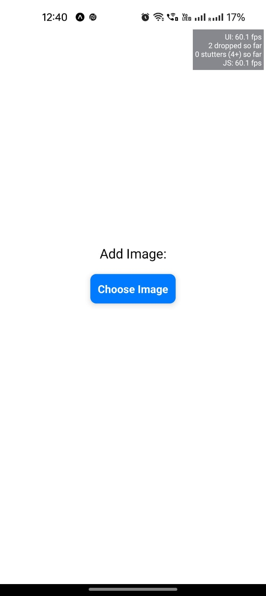
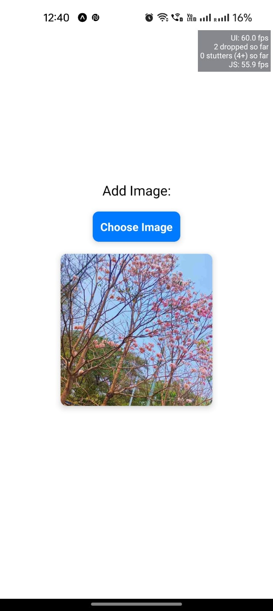
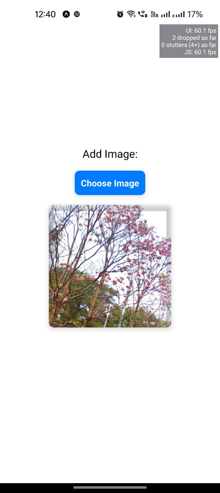

# Background Remover

This Python script uses the rembg library to remove the background from an image. The script allows you to select an image file using a file dialog and then processes the image, saving the output with the background removed as "output.png".

## Prerequisites

Ensure you have the required modules installed before running the script. You can install them using the following command:

## How to run the project

1. Clone the repository

```bash
git clone

```

2. Install the rembg pillow library

```python

pip install requests django python-dotenv

```

3. Run the main file using python manage.py

```python

python3 manage.py runserver

```

## Screenshots







## <a href="https://github.com/ananya26-vishnoi/background-removal-frontend.git">Frontend Link</a>
